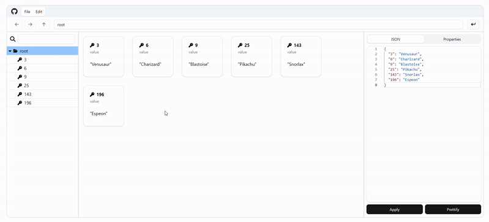

<h1 align="center">JSON Explorer</h1>

  

**JSON Explorer** is the simple JSON editor with powerful UI for you

## Main Features

- Explore JSON with simple UI
  - Drag to select
  - Shift, Ctrl(Command) key for multi selection/deselection
- CRUD items: object, array or any value supported in JSON
- Search any item you need
- Import & Export JSON files
- Undo & Redo features for some mistakes
- Keyboard inputs are also supported

## Demo

- See Demo [here](https://jsonexplorer.net)
